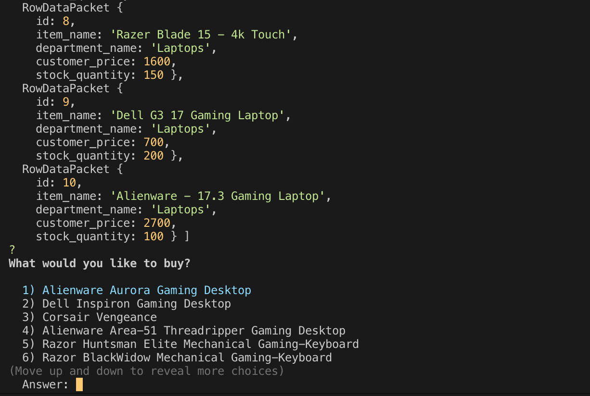
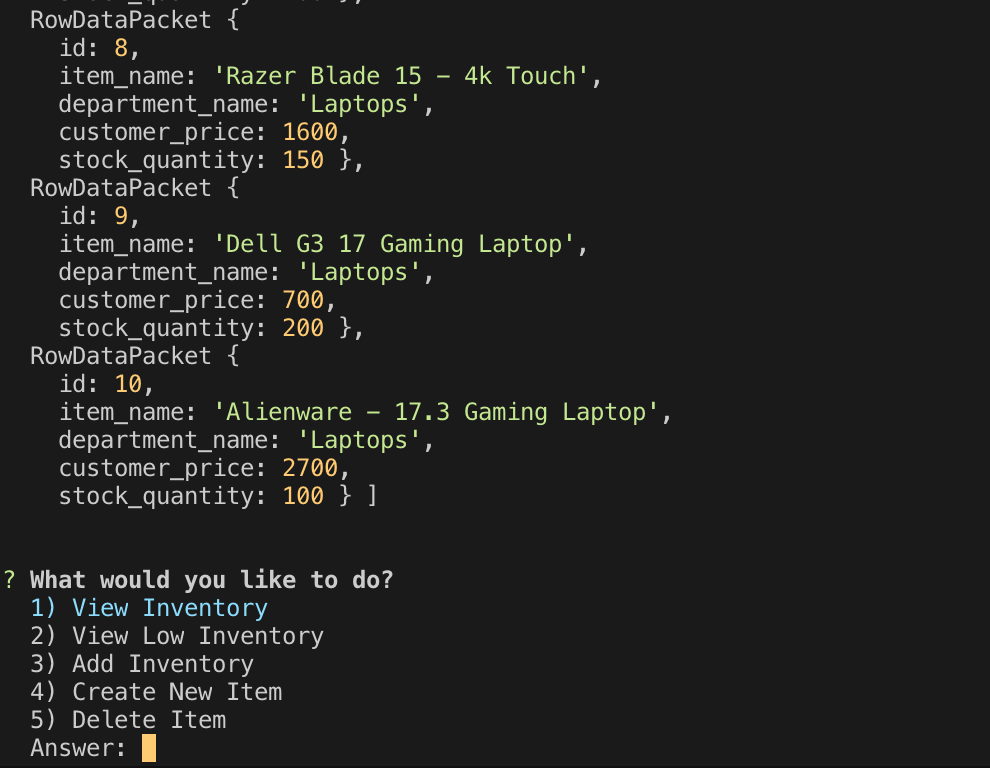
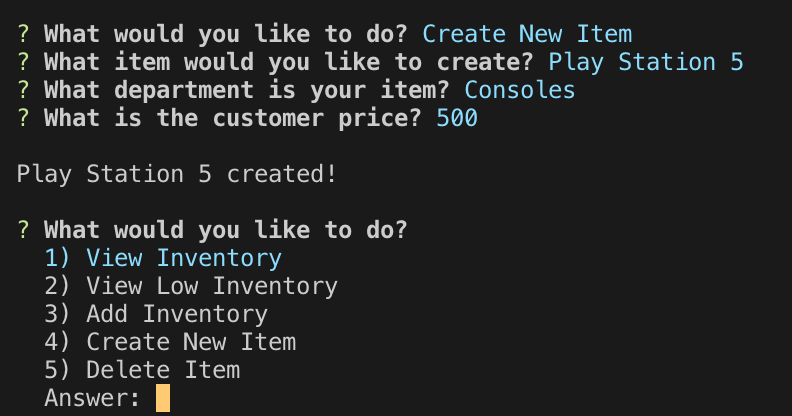

### Bamazon.js ###

# Description #
Bamazon is a inventory-buying and managing application comprised of two javascript-files; bamazonCustomer.js and bamazonManager.js.
Using **bamazonCustomer.js** via Node, users are prompted to buy inventory where their selected quantity will deplete stock from the MySQL store-database.

**bamazonManager.js** is the flipside of bamazonCustomer.js in which users can view inventory, check low-quantities, add to inventory, and remove products from inventory all while modifying the store's database in real-time.

_Selecting *view low-inventory* lets users set a limit that displays all products under set-limit._

_Selecting the *add inventory* lets users add their desired product and place it into a department while updating the corresponding MySQL database in real-time_

# Motivation #
This application is part of the University of Minnesota's Web Application Development program. This particular assignment encouraged students to stretch and apply their learned MySQL abilities.

# Result #
The result is a mock-storefront in which users can easily order, view, and manage a customizable database.

# Improvements #
I would like to add bamazonSupervisor.js where users can view top-grossing products and overhead costs.

 
